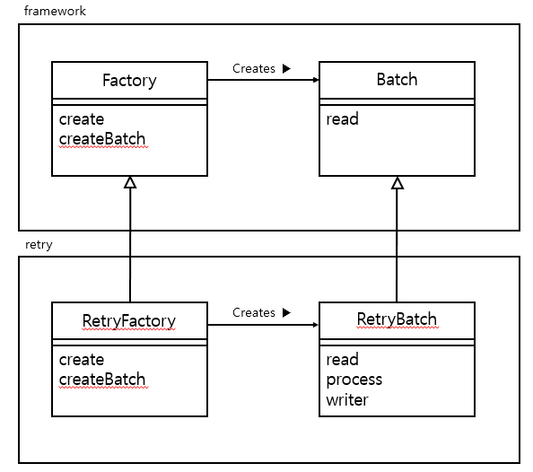

## Factory Method Pattern
Factory Method 방식으로 Instacne하게 되면 그것이 Template Factory Pattern이다.  
Factory란 의미는 공장이라는 뜻이다. 공장은 제품을 찍어내는 역활을 한다.

## 구조 

상위 클래스인 Factory 클래스는 하위 클래스인 RetryFactory를 create 해주는 역활만 함

## 구현예제
framework 패키지
~~~ java

public abstract class Factory {

    public Batch create(String batchType) {
        Batch batch = createBatch(batchType);
        return batch;
    }

    protected abstract Batch createBatch(String batchType);
}

public abstract class Batch {
    
    public abstract String read();
    public abstract String process();
    public abstract String write();
}

~~~

retry 패키지
~~~ java

public class RetryFactory {
  
    @Override
    Batch createBatch(String batchType) {
        return new RetryBatch(batchType);
    }
}

public class RetryBatch extends Batch {
    
    @Override
    public String read() {
        return "재시도 배치데이터를 read 합니다.";
    }

    @Override
    public String process() {
        return "재시도 배치데이터를 process 합니다.";
    }

    @Override
    public String write() {
        return "재시도 배치데이터를 write 합니다.";
    }
}

~~~

메인함수
~~~ java

public class Main {

    public static void main(String[] args) {

        Factory factory = new RetryFactory();
        Batch retryBatch = factory.create("retry");

        retryBatch.read();
        retryBatch.process();
        retryBatch.write();
    }
}

~~~