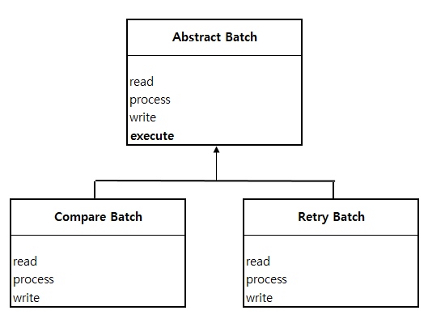

## Template Method Pattern
- 상위 클래스에서는 Template 기능(하위 클래스에서 같은 로직을 사용)을 하는 메소드가 있고 그외 기능은 하위클래스에서 구현하는 패턴  
- 상위 클래스에서는 큰 뼈대(틀)을 구성하고 세부적인 동작은 하위클래스에서 구현하는 패턴  

위에서 execute 함수가 바로 Template Method가 되는 것이다.  

이것을 실제 사용하게 되면  

~~~ java

public class Main {

    public static void main(String[] args) {
        AbstractBatch compareBatch = new CompareBatch();
        AbstractBatch retryBatch = new RetryBatch();

        compareBatch.execute();
        retryBatch.execute();
    }
}

~~~

execute 기능은 동일 하지만 CompareBatch냐 RetryBatch냐에 따라서 내부 구현 기능에 따라서 다른 동작을 하게 된다.  

### 장점

#### 로직 공통화(= 중복 제거, 유지보수 용이)
하위 클래별 공통된 로직을 상위클래스에 작성해 놓으면 수정 할 때 상위클래스에서만 해도 되므로 중복제거와 유지보수 용이성 두마리 토끼를 잡을 수 있다.