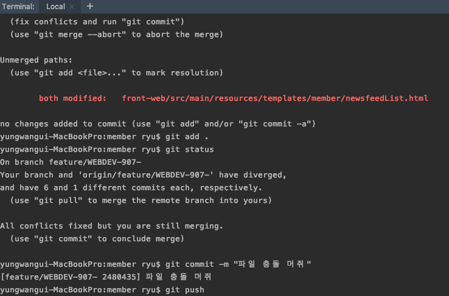

# 상황
A라는 파일이 PR이 올려졌다.  
그 이후 다른 개발자가 같은 파일 다른 부분을 수정하고 PR 하였다.  
처음 올린 A 파일은 리뷰되었고 그 이후 올린 파일은 Bitbucket에서 conflict 됬다고 나타나게 된다.  

먼저 올린 A 파일이 merge 되면서 develop 브랜치와 합쳐졌을꺼고 그래서 아직 남아있는 A파일이 develop브랜치와 달라서 conflict 된거 같다.  

# 해결 방법
- 먼저 terminal 해당 branch 에서 git pull 한다. 
- 그럼 rebase가 되다가 conflict 되어 일시중지 상태가 되는데
- 그때 IDE에서 충돌 된 부분을 해결하고 git add . 를 해주면 충돌이 없어지고
- 그상태에서 git commit , git push  해주면 끝

