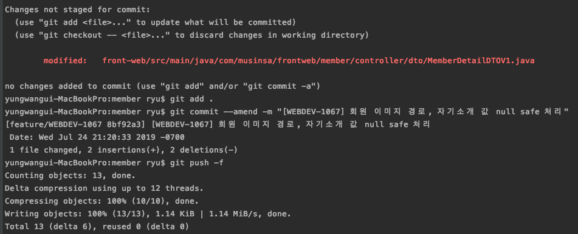

Bitbuket에서 ammend 하여 내가 올린 commit을 해결하고 싶은데 자꾸 reject가 되서  

> git push -f

하였더니 잘 반영되었다.  
알고 보니 -f 옵션을 주게 되면 이전에 올린 커밋을 remove하고 내것을 반영시키는 것이다.

  

뭐 삭제되도 상관 없다면 상관 없는건데 다른 사람이 커밋이거나 삭제가 되면 안된다면 --ammend 하고 -f 옵션 주지 말고 새로 커밋하는게 맞겠다.

**참고**  
https://www.tuwlab.com/ece/22214