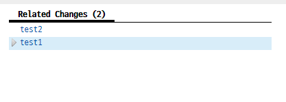
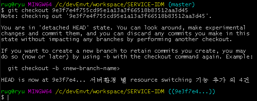
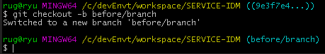

## commit 을 gerrit 원격 서버에 2번 연달아 push 할 때 생기는 문제

### 상황
다른 개발자가 gerrit에 소스 리뷰 요청하였는데 내가 바빠서 나중에 리뷰 한다고 말했고 그 개발자는 새로운 소스를 push한 상태였다.  
**처음 올린 소스를 A_commit**라 하고 **두번째 올린 소스를 B_commit**라고 하자. A소스는 코드 리뷰를 하여 해당 부분을 다시 고쳐달라고 요청한 상태였고 문제는 그이후였다.
고친 내용을 소스 A에다가 ammend 하여야 하는데 동일한 branch에서 연달아 B_commit까지 push하게 되어 현 branch 버전은 B_commit인 상태이다. **어떻게 ammend 하지??**

### 문제는?

위와 같이 연관된 소스가 연달아 commit이 발생했을 때이다.
Related Changes가 나타난 이유는 같은 branch에서 연달아 commit 을 하여 발생한 것이다.  

#### A_commit과 B_commit이 전혀 겹치지 않는다면 브랜치를 나누어야 한다.
master 브랜치에서 소스A에 대한 브랜치, master 브랜치에서 소스B에 대한 브랜치를 **각각** 만들고 각 브랜치에서 push를 해야 위와 같이 related 가 발생하지 않는다.  

#### 연관된 소스였다면 ammend를 하여야 한다.
하지만 A와 B는 연관이 있는 소스였고 그러면 각각 commit을 하는게 아니라 처음 A는 commit을 하고 B는 ammend를 하면 Related Changes 상황은 없었을 것이다.

#### 소스A에 있는 버전으로 checkout하여 거기서 amend한다.
ammend하려 했지만 현재 위치가 B이기 때문에 일단 checkout하여 A로 돌아가서 거기서 ammend를 수행한다.
A로 돌아가는 방법은 master 브랜치로 돌아간다음에 checout하여 만든 A버전에 브랜치를 만들면 된다. 거기서 ammend를 수행하면 됨  
ammend하였으면 해당 브랜치는 필요없으므로 삭제 하면된다.

방법은 master branch 에서  

> git checkout [commitID] 

하게 되면 위 사진같이 이상한 숫자에 branch가 생기는데 이때,   

> git checkout -b [branch-name] 

하면 해당 commitID 버전으로 돌아간다.

#### 소스A를 다시 리뷰 해서 통과시켰더니 소스 B에서 cannot merge 발생
당연한 결과다. A에 특정 파일이 B에도 있었기 때문이다.  
A가 ammend되어 파일이 수정되었는데 B에는 겹치는 파일에 수정된것이 반영이 안됬기 때문이다. 

**이럴땐 이렇게 하면 된다.**   

B버전에 브랜치에서 git rebase master를 한다. 왜냐하면 A가 리뷰가 됬기 때문에 master 브랜치에서 pull하여 최신 버전에 소스를 업데이트 해야하기 때문이다.  
그러면 rebase 도중 both merged 이런 문구가 나올수 있는데 이때 conflit된 부분을 수정해주고 git rebase --continue를 해주면 된다. 그래도 완전히 rebase가 끝나지 않으면 git rebase --skip을 해주면 된다.  
그리고 마지막 단계인 push 명령을 내리면 원격 저장소인 gerrit에게 소스가 최신화 됬어! 라고 알려주는 행위가 되고 발생했던 cannot merge는 해결된다.

### 추가 조사
- checkout과 chrrypick에 차이점을 확실하게 조사
- git checkout하여 해당버전으로 간것과 git reset HEAD해서 가는것과 차이점 조사