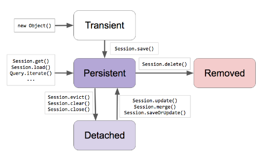

## 엔티티 상태

출처: Inflearn 백기선 Spring JPA
  
  
  

우선, 아래 JPA 코드 부터 보자 

~~~ java
Account account = new Account();
account.setUsername("ryu");
account.setPassword("1111");

Study study = new Study();
study.setName("Spring Data JPA");

account.addStudy(study);

Session session = entityManager.unwrap(Session.class);
session.save(account);
session.save(study);
~~~

### Transient
~~~ java
Account account = new Account();
account.setUsername("ryu");
account.setPassword("1111");

Study study = new Study();
study.setName("Spring Data JPA");
~~~

이 부분이 Transient 이며, JPA는 아직 아무것도 모르고 있는 상태이다.

### Persistent

> session.save(account);

- JPA가 관리중인 상태이다. 아직, DB에 저장 된 건 아니다. 
- 트랜잭션이 끝나야 DB에 반영이 된다.
- Persist Context에 1차 캐쉬(Dirty Checking, Write Behind)로 저장 된다.

### Detached

- return 되어 메소드가 끝나고 트랜잭션이 종료 됬을 때- d
- Persist Context가 더이상 관리 하지않은 상태
- 다시 관리하게 하고 싶으면 ReDetached를 사용하면 된다.

### Removed

- Persist Context 객체를 삭제하고 싶을 때 사용
- Persist Context에 관리 되어지다가 commit 발생하면 객체가 삭제가 된다.

## Cascade 옵션

- Entity 상태를 전이시키는 옵션
- 두 Entity가 Parents, Child 관계일 때 사용
- DB에서 FK 연관 테이블은 DELETE 명령어 되지 않을 때 cascade 옵션을 주어 관련 모든 데이터 삭제 하는 기능 생각하면 됨

