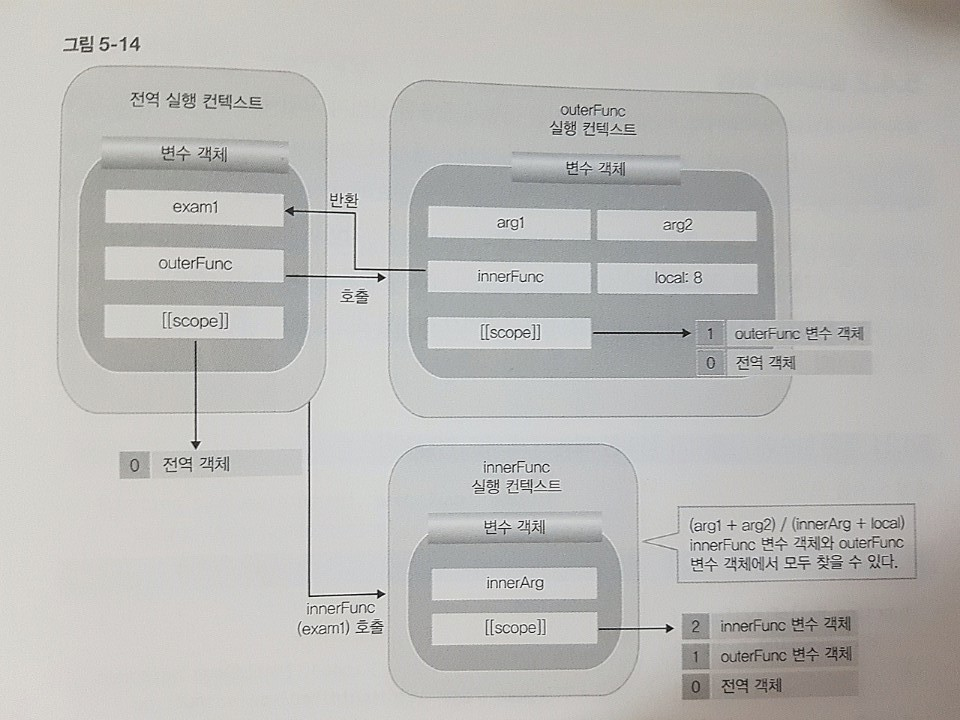

### 클로저란?

> 이미 생명 주기가 끝난 외부 함수의 변수를 참조하는 함수 - 인사이드 자바스크립트

외부에서 함수 내 지역변수는 참조하지 못한다.  
하지만, 클로저 함수는 외부 지역변수를 참조 할 수 있다.

#### 기본예제
~~~ javascript
function outerFunc() {
    var x = 10;
    var innerFunc = function() {
        console.log(x);
    }
    return innerFunc;
}

/**
 * outerFunc 실행 컨텍스트는 종료 되었지만
 * outerFunc 스코프 그대로 inner 변수객체에 전해진다.
 * 결과적으로 outerFunc 스코프까지 사용 할 수 있게 된다.
 **/
var inner = outerFunc();

/**
 * 외부에서 지역변수 참조 못한다.
 * 하지만 클로저 함수라면 특정 외부 함수내 지역변수를 참조 할 수 있다.
 * 여기서 inner()가 클로저이고 outerFunc()가 외부 함수 이다.
 */
inner();    // 10
~~~

#### 응용예제1

~~~ javascript
function outerFunc(arg1, arg2) {
    var local = 8;
    function innerFunc(innerArg) {
        console.log(arg1 + arg2) / (innerArg + local);
    }
    return innerFunc;
}
var exam1 = outerFunc(2, 4);
exam1(2);
~~~

#### 클로저 활용 예제 1

함수를 캡슐화 하고자 할 때 사용한다. 
buffAr 변수 객체가 전역 객체로 존재 하게 되면 값이 바뀔 위험이 크다. 템플릿 같이 쓰고 있는 buffAr 변수 객체를 함수 안 지역변수로 선언하여 값을 안전하게 보호 하면서 클로저 함수로 바뀌는 부분에 값만 던지면 의도데로 로직을 구현 할 수 있다.

~~~ script 
var getCompleteStr = (function(){
    var buffAr = [
        'I am ',
        '',
        '. I live in ',
        '',
        '. I\'m ',
        '',
        ' years old. '
    ];

    return (function(name, city, age){
        buffAr[1] = name;
        buffAr[3] = city;
        buffAr[5] = age;

        return buffAr.join('');
    });
})();

var str = getCompleteStr('yungwang', 'seoul', 31)
console.log(str);
~~~

