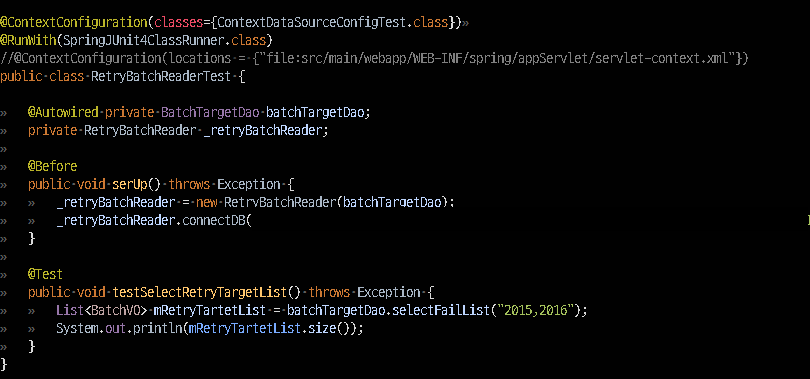

### 백문이 불여일견
개발 할 때 짧은 주기로 테스트를 해가면서 개발하면 버그도 줄어들어 필요성은 알겠다.  
하지만 TDD? Junit? 테스트자동화? 와닿지 않는다. 
일단 Junit 부터 체화시켜 테스트하는게 편해지면 그때 확실히 알게 될것이니 Junit이 익숙해져 가는 과정을 기록하여 체화시키도록 하자

### Spring 기반 테스트 환경 만들기
원래데로라면 web.xml에서 설정한 Spring Container와 Dispatcher Servlect이 만들어져서 Spring MVC기반에 엔트프라이즈 웹 어플리케이션을 만들고 이용하지만  
테스트 할 때는 언제 그것을 다 셋팅하고 또 WAS를 동작시킬 것인가 단위 테스트 하려하는데 배보다 배꼽이 큰 격이 된다.  

이러한 문제를 해결 할 수 있도록 Junit과 Spring에서 모두 제공하고 있다. 아래를 보자

### @RunWith(SpringJUnit4ClassRunner.class)

> <dependency>
    <groupId>org.springframework</groupId>
    <artifactId>spring-test</artifactId>
    <version>3.1.1.RELEASE</version>
    <scope>test</scope>
</dependency>

SpringJUnit4ClassRunner 역활은 테스트용 Spring Container를 제공한다는 의미이며 import를 시키기 위해서는 test 하위 패키지에서 작성해야 한다.  

### @ContextConfiguration(classes={ContextDataSourceConfigTest.class})
필자는 DB 설정 정보를 java config 방식으로 하여서 @Configuration한 클래스를 위와 같이 선언하여 정보를 가져올 수 있도록 하였다. 

지금 까지 말한 내용에 코드는 아래와 같다.

다음 포스팅에서는 특정 클래스에 대한 단위테스트 하는 과정을 통해 좀 더 junit에 대해 알아 보도록 하겠다.