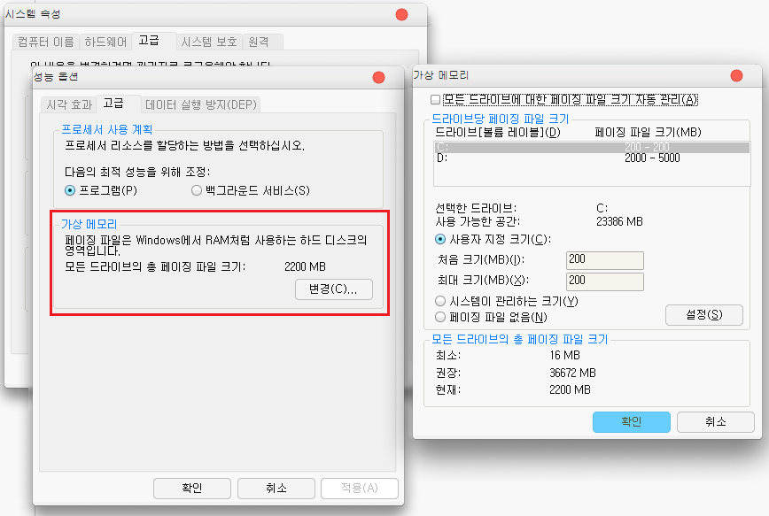
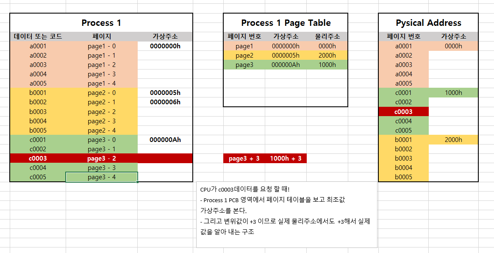

### 가상 메모리란 ?
Linux 기준, 프로세스당 메모리를 4GB를 차지 한다고 합니다. (왜 4GB 인지는 아래에서 다시 설명 하도록 하겠습니다.)
보통 물리메모리는 보통 8~16GB 인데, 프로세스 하나당 4GB 라면 몇개의 프로세스 밖에 메모리에 올리지 못하게 됩니다.  
사용자 입장에서는 몇개 프로그램 띄우면 더이상 못 띄우는 상황이 발생하는 거죠. 하지만 가상메모리 즉, **물리메모리 보다 훨씬 큰 용량에 메모리가 있는 것처럼** 하여  한정적인 물리메모리 용량보다 훨씬 더 많은 프로세스를 사용 할 수 있게 하는 기법입니다.  

### 가상 메모리 원리
웹 개발자라면 페이징이라는 개념을 아실것이라고 생각합니다. 브라우저에서 전체 데이터 리스트를 뿌리면 부하도 가고 불필요 하기도 해서 특정 ROW 구간만 가져와서 브라우저에서 표시하는 방식이죠.  

가상 메모리 원리도 바로 이 페이징 개념입니다.  
프로세스는 먼저 가상 메모리라는 특정 영역(디스크)에 할당 하여 페이징 단위(4KB, ...)로 전체 가상 메모리를 페이징 단위로 쪼개게 됩니다.  

가상 메모리 디스크에 할당 된다고 하였는데 실제 OS에서도 확인 할 수가 있습니다. 참고로 SSD + HDD 구성이라면 가상 메모리를 SSD에 할당 하는것이 좋습니다. HDD 보다 R/W가 훨씬 빠르니까요.

**가상메모리 구조 이미지 첨부 하기**  

### MMU(Memory Management Unit)
위 그림에서 MNU 라는 말이 나오는데 가상 메모리 구조 특성상 가상 메모리 <--> 물리메모리 변환이 매번 이루어지는데 이 또한 I/O이며 CPU와 메모리간 처리 속도에 저하에 원인이 됩니다.  
이런 속도 개선을 위해 MNU라는 하드웨어를 두고 속도를 높이기 위해 사용된 장치입니다.