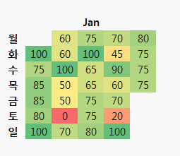

# Month Score

# :book: 개발 일지 
  

- 에피파니(Epiphany) 적인 경험, 반성, 개념, Snippet 등 머릿속 추상적인 것들이나 배워야 할 내용을 글로 배출하면서 체화시켜 어제보다 발전한 나를 만드는 도구
- 하루에 모든 Input이 모이는 장소
- 하루는 쌓이는 것 

# :lock: 작성규칙
- 이해한 내용을 **나만의 언어** 로 작성
- 각 doc별로 Learning-Queue.md 파일을 만들어 궁금한거 배우고 싶은거 queue 정리
- 못한것은 주말에 **반드시** 마무리
- 제목에 반드시 TAG 부터 붙인다.
- 못했다면 사유를 반드시 적자
- 최대한 영어 활용 (파일명 부터)

# :pushpin: Tag 작성규칙
- 📕[PLAN]: 기간과 계획을 잡고 해야 할 때
- 📗[POSTING]: 블로그 포스팅
- 📘[APPLIYED]: 지식이 활용 됬을 때
- 🔍[SEARCH]: 추가 조사가 필요 할 때

# :four_leaf_clover: 오늘 하루 체크 피드백
매일 하루를 얼마나 성실히 잘 보냈는지 아래 템플릿 바탕으로 체크하여 파일 제목에 점수를 매겨 보자

파일제목
> [오늘일자]일_[오늘점수]점.md

**평일**
~~~ 
:heavy_check_mark:
:x:
## 나의태도
- **귀차니즘을 얼마나 이겼느냐**에 따라 성취여부가 결정 된다.
- 포스팅 했다고 끝이 아니다. **내용을 다듬고 업데이트 하면서 반복 하고 적용,응용**해야 체화가 된다.
- **확실한 이유**를 바탕으로 결정하였는가
- **의식적인 생각**으로 항상 더 나은 방법은 없는지 생각하였는가  
- 발생한 **문제들 두려워 말고 재밋는 문제** 풀이로 생각하였는가

## 출/퇴근 (10점) (아래중 하나 이상)
- [] 독서, 내용 정리 하였는가? 
- [] 즐겨찾기, 트렌드(InfoQ 등), Github 보았는가? 
- [] 유트브 유용 영상 보았는가? 

## 영어공부 (30점)
- [] 출근할 때, 쉐도잉 하였는가? (10점)
- [] 2일에 1번 쓰고 싶은 문장 만들기, 반드시 그 상황에서 쓴다는 각오로 (10점)
- [] Dictation (10점)

## 코딩문제 (50점)
- [] 점심, 코딩 문제 풀기 (25점)
- [] 집, 코딩 문제 풀기 (25점) 

## 이번달 목표 진척 체크 (20점)
- [] 패스트 캠프 컴퓨터 공학 강의 - OS 파트 정리 되고 있는가? (10점)
- [] 리펙토링/디자인 패턴 정리 되고 있는가? (10점)

~~~

**주말**
~~~
:heavy_check_mark:
:x:
[] 한 주 회고 작성 및 차주 계획 세웠는가? (10점)
[] 못했던 내용을 마무리 하였는가? (50점)
[] 시간 날때마다 영어 말하기 연습하였는가? (cake, 쉐도잉 표현, 내가 만든 문장등.) (30점)
~~~

# :zap: 목차

## Git
- [동일 branch에서 연속 Commit 하였을 때 생기는 문제](https://goo.gl/YUvfNr)
- [cherry-pick, rebase, merge 각각의 용도 조사 및 실전 적용](https://goo.gl/N5eeku)
- [내가 먼저 올려도 다른 사람이 먼저 리뷰가 된다면](https://goo.gl/3rdZVC)
- [Git 구조](https://goo.gl/df3CTC)
- [Git 명령어 모음](https://goo.gl/N3gRgf)
- [Git 브랜치 전략](https://goo.gl/K1Vsnh)

## Http
- [HttpServletRequest 스트림을 여러번 쓰고 싶을 때(Filter 역활)](https://goo.gl/w2L1gw)

## Java
- [인터페이스 활용](https://goo.gl/UAdbPN)
- [Static에 대해서](https://goo.gl/s7DzPF)

## Junit
- [Junit을 왜 사용하는지 실무에 적용해 보고 알았다.](https://goo.gl/2M2mnu)
- [Junit으로 단위테스트를 적용해 보자](https://goo.gl/ghhc5j)

## Maven
- [ [기본] 메이븐 사용법 정리](https://goo.gl/Q4eF4X)

## OS
- [가상메모리](https://goo.gl/HUPoVX)
- [스레드](https://goo.gl/J4TVCP)
- [운영체제 구조](https://goo.gl/seyj6M)
- [운영체제 스케줄링 기법 정리](https://goo.gl/seyj6M)
- [운영체제 역사](https://goo.gl/FAyw27)
- [코드가 실행되는 원리](https://goo.gl/RgPzUi)
- [프로세스 커뮤니케이션 - IPC](https://goo.gl/cPZELJ)

## Refactoring
- [OVERVIEW](https://goo.gl/5ZJxSS)
- [매직넘버를 기호상수로 치환 하기](https://goo.gl/CBdLg1)
- [메서드 추출(정리)](https://goo.gl/hWU37M)
- [분류 코드를 클래스로 치환](https://goo.gl/1axZJx)
- [분류 코드를 하위 클래스로 치환 - 분류 코드마다 동작이 다른 경우(1)](https://goo.gl/NdARBR)
- [제어 플래그 줄이고 return, break로 대체하기](https://goo.gl/w1kshK)
- [조건문 간결화](https://goo.gl/yzyrgM)

## Spring
- [LearningQueue](https://goo.gl/CsvBXa)
- [멀티스레드 환경에서 Bean객체 사용 전략]()
- [WAS 기동시 Spring 동작 순서 정리]()
- [짤막 지식](https://goo.gl/aoCskp)
- [Constructor Injection권장 이유](https://goo.gl/YHxMhn)
- [Spring Context 구성 전략](https://goo.gl/trJx7t)
- [Spring Container 파헤 치기](https://goo.gl/aRXAua)
- [IOC 컨테이너 파헤치기](https://goo.gl/aRXAua)

## SqlServer
- [쿼리 Statistics 정보 확인 방법](https://goo.gl/kwsepz)

## Design Pattern
- 하위 클래스에게 위임하기
    + [Factory Method Pattern](https://goo.gl/NwYV6J)
    + [Template Method Pattern](https://goo.gl/M16SLU)

