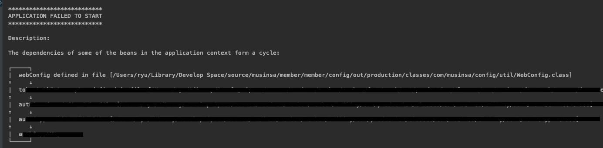

### 발생상황

스프링부트에서 인터셉터를 추가하기 위해 Constructor Injection으로 추가하였는데 

~~~ java
@Configuration
@RequiredArgsConstructor
public class WebConfig implements WebMvcConfigurer {

    private final HandlerInterceptor handlerInterceptor;
    
    ...
}
~~~

아래와 같은 오류가 발생하였다.

### 참고
- [Spring Circular Reference (순환 참조) 에 대해서 쉽게 이해하기](http://blog.naver.com/PostView.nhn?blogId=gngh0101&logNo=221179100057&parentCategoryNo=&categoryNo=32&viewDate=&isShowPopularPosts=false&from=postView)
- [Spring Security circular bean dependency](https://stackoverflow.com/questions/40695893/spring-security-circular-bean-dependency)
- [Spring referece](https://docs.spring.io/spring/docs/4.3.10.RELEASE/spring-framework-reference/htmlsingle/#beans-dependency-resolution)
